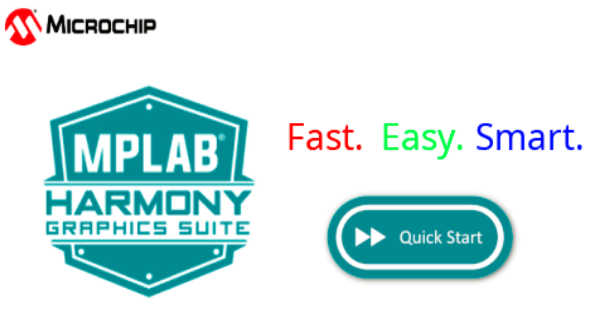

---
parent: Example Applications
title: Legato Quickstart
nav_order: 3
---

# Legato Quickstart

This demonstration provides a touch-enabled starting point for the legato graphics library.

|MPLABX Configuration|Board Configuration|
|:-------------------|:------------------|
|[legato\_qs\_ck\_cu\_wqvga.X](./firmware/legato_qs_ck_cu_wqvga.X/readme.md)| [PIC32CK GC Curiosity Ultra Development Board](https://www.microchip.com/DevelopmentTools/ProductDetails/PartNO/EV87D54A) using Low-Cost Controllerless Graphics to drive the [High-Performance 4.3" WQVGA Display Module with maXTouch® Technology](https://www.microchip.com/DevelopmentTools/ProductDetails/PartNO/AC320005-4)|

